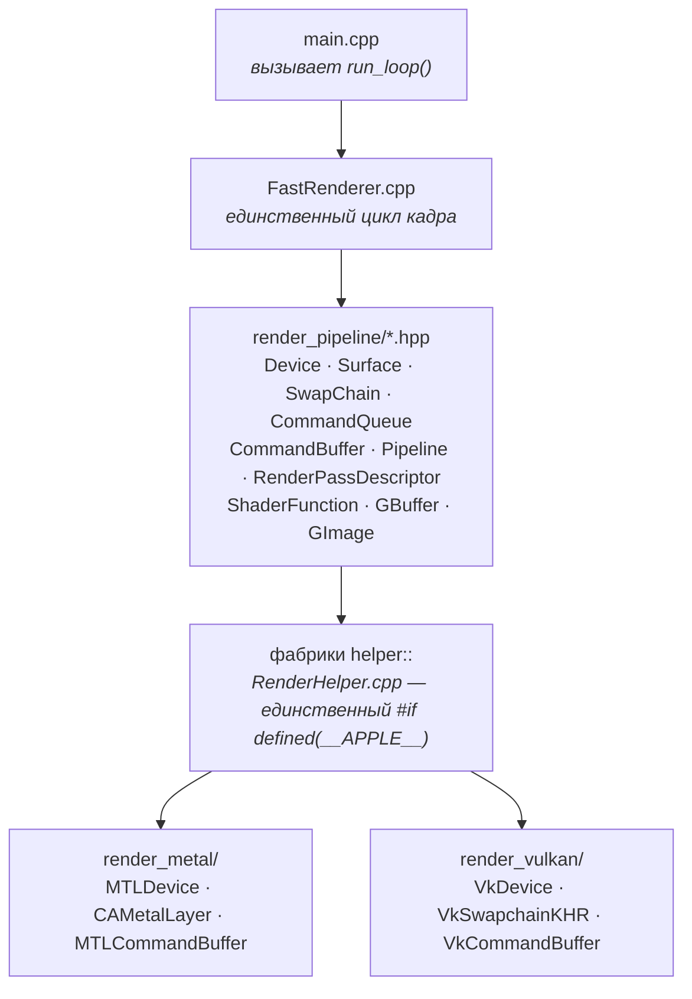

# Два бэкенда, один кадр

`FastRenderer::run_loop()` — теперь единственный цикл отрисовки в проекте. Он написан один раз
поверх абстрактных интерфейсов из `render_pipeline/` и выдаёт одну и ту же сетку, те же цвета и ту
же панель ImGui независимо от того, исполняется он на Metal или на Vulkan. Ниже — описание того,
как устроен обобщённый пайплайн под этим циклом.

**Статус:** собирается и работает на Windows / Vulkan, слои валидации молчат.
Путь Metal был отредактирован, но здесь не компилировался.

---

## Содержание

1. [Общая форма](#1-общая-форма)
2. [Порядок инициализации](#2-порядок-инициализации-и-почему-именно-такой)
3. [Кадр](#3-кадр)
4. [Карта соответствий](#4-карта-соответствий)
5. [Модель биндингов](#5-модель-биндингов)
6. [Паритет шейдеров](#6-паритет-шейдеров)
7. [Кто владеет синхронизацией](#7-кто-владеет-синхронизацией)
8. [Попиксельный паритет](#8-попиксельный-паритет-решения-которые-молча-его-ломают)
9. [Что изменилось](#9-что-изменилось)
10. [Границы и ограничения](#10-границы-и-ограничения)

---

## 1. Общая форма

Три слоя. Код приложения касается только двух верхних; нижний выбирается через CMake и ни разу не
упоминается в заголовках, которые приложение подключает.



Правило, которое удерживает конструкцию честной: **все ветвления по бэкенду живут в одном файле** —
`render_pipeline/RenderHelper.cpp`. В `FastRenderer.cpp` нет ни одного `#ifdef`, и в `main.cpp`
тоже — он теперь состоит из четырёх строк обработки ошибок вокруг `run_loop()`.

---

## 2. Порядок инициализации (и почему именно такой)

Последовательность не произвольна: у трёх шагов есть жёсткая зависимость, о которой знает только
один из двух бэкендов, а общий код обязан удовлетворить более строгому.

| № | Вызов | Metal | Vulkan |
|---|---|---|---|
| 01 | `helper::createSurface(window, BGRA8_UNORM)` | Забирает `NSView` из окна GLFW и включает layer-backing. | `glfwCreateWindowSurface` поверх общего `VkInstance`. |
| 02 | `helper::createDefaultDevice(surface)` | Системный `MTLDevice` по умолчанию, поверхность игнорируется. | **Требует** поверхность: физическое устройство подходит только если какое-то из его семейств очередей умеет презентовать именно в *эту* поверхность. Поэтому surface создаётся первым. |
| 03 | `helper::createCommandQueue(device)` | Один `newCommandQueue`. | Графическая и презентационная `VkQueue`, командный пул, и по две штуки всего, что переиспользуется покадрово: командный буфер, fence, пул дескрипторов. |
| 04 | `helper::createSwapChain(device, queue, surface, w, h)` | `CAMetalLayer`, прикреплённый к вью. | `VkSwapchainKHR`, image views, семафоры «кадр отрисован» (на изображение), семафоры «изображение доступно» (на слот кадра), кэш фреймбуферов. |
| 05 | `helper::initImgui(swapChain)` | Достаёт из свопчейна только устройство. | Нужны очередь, собственный пул дескрипторов, количество изображений свопчейна и совместимый `VkRenderPass`. **Именно поэтому параметр — свопчейн, а не устройство**, и поэтому вызов переехал после шага 04. |
| 06 | `helper::createShaderFunction(device, SHADER_DIR/"PlaneShader", "plane_vertex_shader")` | Дописывает `.metal`, компилирует исходник в рантайме, достаёт `MTLFunction` по имени. | Загружает `PlaneShader.plane_vertex_shader.spv`, собранный CMake. Точка входа SPIR-V всегда `main`. |
| 07 | `helper::createPipeline(device, vs, fs, targetFormat)` | `MTLRenderPipelineState` из двух функций плюс форматы аттачментов. | Те же два входа плюс `VkDescriptorSetLayout`, `VkPipelineLayout` и рендер-пасс из кэша устройства. |
| 08 | `device->createBuffer(Vertex \| Index \| Uniform, Static \| Dynamic, …)` | `MTLBuffer` с shared-хранилищем. | Память `HOST_VISIBLE \| HOST_COHERENT`, замапленная навсегда. Буфер `Dynamic` незаметно для вызывающего выделяется как два выровненных региона — по одному на слот кадра. |

---

## 3. Кадр

Восемь вызовов, ровно те же, что были в Metal-only цикле. То, что следует за каждым из них на
стороне Vulkan, — это всё, что драйвер Metal делал неявно.

### 01 — `swapChain->acquireNextImage()` → `shared_ptr<GImage>`

* **Metal:** `[layer nextDrawable]`. Возвращает nil, когда окно свёрнуто.
* **Vulkan:** открывает кадр на очереди (ждёт fence слота, сбрасывает его командный буфер и пул
  дескрипторов), затем `vkAcquireNextImageKHR`, затем ждёт, если предыдущий кадр всё ещё владеет
  этим изображением. При `OUT_OF_DATE` пересобирает свопчейн и возвращает `nullptr` — цикл просто
  пропускает кадр, ровно как в случае nil drawable.

### 02 — `createRenderPassDescriptor()` → `setColorAttachment(0, img, clear, colour)`

* **Metal:** заполняет `MTLRenderPassDescriptor` напрямую.
* **Vulkan:** сохраняет аттачмент как обычное значение. Построить он пока ничего не может —
  у фабрики нет устройства. Разрешение отложено до шага 04.

### 03 — `helper::createCommandBuffer(cmdQueue)`

* **Metal:** совершенно новый autoreleased `MTLCommandBuffer`.
* **Vulkan:** *представление* на заранее выделенный `VkCommandBuffer` текущего слота, запись уже
  открыта. Владеет им очередь и переиспользует каждые два кадра.

### 04 — `buffer->beginRenderPass(pass)`

* **Metal:** `renderCommandEncoderWithDescriptor:`.
* **Vulkan:** теперь устройство доступно, поэтому: собрать `RenderPassKey` из формата аттачмента и
  флагов очистки → кэшированный `VkRenderPass` → кэшированный `VkFramebuffer` из свопчейна →
  `vkCmdBeginRenderPass` → выставить динамические viewport и scissor на весь аттачмент, что Metal
  делает бесплатно.

### 05 — `setRenderPipeline` · `setVertexBuffer(0, …)` · `setUniformBuffer(1, …)`

* **Metal:** каждый вызов идёт прямо в энкодер как `setVertexBuffer:atIndex:` /
  `setFragmentBuffer:atIndex:`.
* **Vulkan:** пайплайн биндится сразу, а вызовы для буферов только *запоминают*, что привязано.
  Дескрипторный набор не может существовать раньше, чем известен layout, и один набор способен
  покрыть все слоты сразу.

### 06 — `buffer->drawIndexed(indexBuffer, UInt16, 6, …)`

* **Metal:** `drawIndexedPrimitives:` с байтовым смещением в индексном буфере.
* **Vulkan:** выделить дескрипторный набор из пула этого кадра, записать каждый запомненный слот,
  забиндить, затем нарисовать. Байтовое смещение из интерфейсаad сворачивается в
  `vkCmdBindIndexBuffer`, а не пересчитывается в количество индексов — так бэкенды остаются
  эквивалентны даже для смещений, не кратных размеру индекса.

### 07 — `helper::renderInternalImgui(buffer)` → `buffer->endRenderPass()`

* **Metal:** ImGui нужны и командный буфер, и энкодер — отсюда `nativeEncoder()`.
* **Vulkan:** отдельного объекта-энкодера нет, поэтому `nativeEncoder()` возвращает тот же командный
  буфер, пока рендер-пасс активен, и `nullptr` вне его — задокументированный контракт сохраняется.

### 08 — `buffer->present(image)` → `buffer->commit()`

* **Metal:** `presentDrawable:`, затем `commit`.
* **Vulkan:** `present()` только запоминает, в какое изображение свопчейна целимся. `commit()`
  завершает запись, сбрасывает fence слота, отправляет сабмит с семафорами ожидания/сигнала и этим
  fence, вызывает `vkQueuePresentKHR` и переключает слот кадра.

> **Отложенная пересборка.** Когда презент возвращает `OUT_OF_DATE` или `SUBOPTIMAL`, свопчейн не
> пересобирается на месте — только что отправленный кадр всё ещё ссылается на эти image views.
> Выставляется флаг, а работу делает следующий `acquireNextImage()`.

---

## 4. Карта соответствий

По строке на абстракцию. Там, где колонки резко несимметричны, эта асимметрия и есть причина
существования обёртки.

| Интерфейс | Metal | Vulkan |
|---|---|---|
| `Surface` | `NSView` + layer-backing | `VkSurfaceKHR` |
| `Device` | `id<MTLDevice>` | `VkPhysicalDevice` + `VkDevice`, индексы семейств очередей, кэш рендер-пассов, текущий слот кадра |
| `CommandQueue` | `id<MTLCommandQueue>` | `VkQueue` ×2, `VkCommandPool`, и по ×2: `VkCommandBuffer`, `VkFence`, `VkDescriptorPool` |
| `SwapChain` | `CAMetalLayer` | `VkSwapchainKHR`, image views, семафоры, кэш фреймбуферов, отслеживание изображений «в полёте» |
| `GImage` | `id<CAMetalDrawable>` и его текстура | Невладеющие `VkImage` + `VkImageView` + индекс изображения + свопчейн-владелец |
| `GBuffer` | `MTLBuffer` с shared-хранилищем | Замапленный `HOST_COHERENT` `VkBuffer`; `Dynamic` = по региону на слот кадра |
| `ShaderFunction` | `MTLFunction`, компилируется из исходника в рантайме | `VkShaderModule`, загружается из SPIR-V, собранного CMake |
| `Pipeline` | `MTLRenderPipelineState` | `VkPipeline` + `VkPipelineLayout` + `VkDescriptorSetLayout` |
| `RenderPassDescriptor` | `MTLRenderPassDescriptor` | Объект-значение; распадается на `VkRenderPass` + `VkFramebuffer` + clear values в момент begin |
| `CommandBuffer` | `MTLCommandBuffer` + `MTLRenderCommandEncoder` | Одолженный `VkCommandBuffer`; обе роли схлопываются в одну ручку |

### Два кэша, намеренно в разных местах

Metal каждый кадр строит новый дескриптор пасса, и это бесплатно. Vulkan так не умеет, поэтому
стоимость гасится кэшированием — а *где* живёт каждый кэш, определяется тем, что его инвалидирует.

* **Рендер-пассы живут на устройстве.** Они зависят только от форматов аттачментов и load/store op,
  поэтому переживают ресайз окна и разделяются всеми пайплайнами и ImGui.
* **Фреймбуферы живут на свопчейне.** Они ссылаются на его image views, значит обязаны умирать
  вместе с ними в `recreate()`.

> **Совместимость** рендер-пассов в Vulkan зависит только от форматов и количества сэмплов, но не от
> load/store op. Именно это позволяет собрать пайплайн против кэшированного варианта «с очисткой» и
> запускать его внутри варианта «с загрузкой», и именно поэтому ImGui можно один раз при инициализации
> отдать презентационный рендер-пасс свопчейна, и он останется валидным всю сессию.

---

## 5. Модель биндингов

Это единственное проектное решение, которое пришлось изобрести, а не перевести, — потому что
абстрактный `createPipeline()` вообще не несёт описания вершинного layout.

Не несёт он его потому, что Metal здесь в нём не нуждается. `plane_vertex_shader` читает геометрию
прямо из `const device VertexData* [[buffer(0)]]` по индексу `vertex_id` — во всём пути Metal нет ни
одного вершинного дескриптора. Выбор стоял так: расширить публичный API параметром вершинного
layout, либо заставить GLSL делать ровно то же, что делает MSL.

**GLSL делает то же, что MSL.** Геометрия приходит из read-only storage-буфера по индексу
`gl_VertexIndex`, пайплайн объявляет ноль вершинных биндингов и ноль атрибутов, а номер слота *и
есть* номер биндинга дескриптора — ровно так же, как он является индексом `[[buffer(n)]]` в Metal.

```
descriptor set 0
  binding 0        STORAGE_BUFFER   vertex            <- setVertexBuffer(0, …)
  binding 1 .. 7   UNIFORM_BUFFER   vertex | fragment <- setUniformBuffer(n, …)
```

Все слоты объявлены независимо от того, использует их шейдер или нет, поэтому один layout обслуживает
любую пару шейдеров, соблюдающую соглашение; неиспользованные биндинги просто остаются незаписанными.

Побочный эффект, о котором стоит знать: два вызова цикла для слота 1 — один для `ShaderStage::Vertex`,
один для `Fragment` — схлопываются в одну запись дескриптора, потому что один биндинг Vulkan уже
покрывает обе стадии. Metal реально нуждается в паре; здесь второй вызов идемпотентен.

Дескрипторный набор выделяется на каждый draw-вызов, а не кэшируется. Это не лень: бэкенд ImGui
биндит собственные наборы в set 0 между нашими вызовами отрисовки, поэтому любой кэшированный
биндинг был бы обязан отслеживать чужое состояние, чтобы остаться корректным. Весь пул сбрасывается
один раз за кадр.

---

## 6. Паритет шейдеров

`shaders/glsl/PlaneShader.vert` и `.frag` — построчные порты MSL. Три детали решают, действительно ли
они дают те же пиксели.

### Позиция фрагмента — это не clip space

MSL читает `in.clipSpacePosition.xy`, что вопреки имени в фрагментной функции является позицией во
фреймбуфере в пикселях: начало координат сверху слева, выборка в центрах пикселей. У
`gl_FragCoord.xy` в Vulkan ровно такая же семантика, поэтому сетка ложится в те же пиксели. Никакой
переворот по Y не нужен и не применяется.

### Раскладка uniform-блока — вот где ловушка

Структура на стороне C++ — пять плотно упакованных float по смещениям 0, 4, 8, 12, 16:

```cpp
struct Uniforms { float viewportSize[2]; float scale; float pan[2]; };
```

Очевидный перевод в GLSL неверен. Запись `vec2 viewportSize; float scale; vec2 pan;` поместит `pan`
на смещение 16 по правилам std140, потому что `vec2` выравнивается по 8, — шейдер молча прочитал бы
`panX` из ячейки `panY`, и сетка бы уехала. Объявление блока как **пяти скалярных float**
воспроизводит C++-раскладку в точности, так как скалярный float выравнивается по 4 в std140.
Никаких расширений, никакого `scalar_block_layout`, никаких паддингов.

### Сборка

CMake компилирует каждую точку входа в отдельный модуль SPIR-V, называя его по *логическому* имени
функции, чтобы место вызова осталось идентичным на обеих платформах:

```
PlaneShader.vert  --glslc-->  ${SHADER_DIR}/PlaneShader.plane_vertex_shader.spv
PlaneShader.frag  --glslc-->  ${SHADER_DIR}/PlaneShader.plane_fragment_shader.spv
```

`SHADER_DIR` указывает на `shaders/metal` на Apple (компиляция в рантайме, исходники используются
на месте) и на `${CMAKE_BINARY_DIR}/shaders` на Windows, так что ни один сгенерированный артефакт не
попадает в дерево исходников. Приложение передаёт путь без расширения плюс имя функции; каждый
бэкенд дописывает своё соглашение.

---

## 7. Кто владеет синхронизацией

Metal прячет всё это целиком. Разделение примитивов между двумя объектами, а не сваливание их в один,
и есть то, что удерживает цикл кадра свободным от понятий Vulkan.

| Примитив | Количество | Владелец | Что охраняет |
|---|---|---|---|
| `VkFence` | на слот кадра (2) | `CommandQueue` | Переиспользование командного буфера и его пула дескрипторов со стороны CPU |
| `imageAvailable` | на слот кадра (2) | `SwapChain` | Сигналится acquire; сабмит ждёт его на `COLOR_ATTACHMENT_OUTPUT` |
| `renderFinished` | на изображение свопчейна | `SwapChain` | Сигналится сабмитом; презент ждёт его |
| `imagesInFlight` | на изображение свопчейна | `SwapChain` | Помнит, чей fence последним трогал изображение, чтобы в него не начали писать слишком рано |

`renderFinished` индексируется **по изображению**, а не по слоту кадра. Семафор «на слот» может быть
переиспользован, пока презент, ожидающий его, ещё не завершился, — это классический источник
плавающих ошибок валидации при ресайзе.

> **Один fence, сбрасывается поздно.** Fence слота ожидается в `acquireNextImage()`, но сбрасывается
> только непосредственно перед сабмитом в `commit()`. Именно это делает пропуск кадра безопасным:
> если acquire не удался и цикл сделал `continue`, ничего не было отправлено, fence остался
> просигналенным, и следующий `beginFrame()` на том же слоте вернётся мгновенно вместо дедлока на
> fence, который никто уже не просигналит.

### Правило разрушения

Metal держит ресурс живым, пока не завершится каждый ссылающийся на него командный буфер. Vulkan —
нет, поэтому всему, что уничтожается, пока кадр может быть «в полёте», нужен явный
`vkDeviceWaitIdle`. Это касается трёх мест: деструктора `VulkanBuffer`, деструктора `VulkanPipeline`
и `ShutdownImguiVulkan()`.

> **Именно об этом сообщал лог валидации.** Все четыре ошибки — два `vkDestroyBuffer`, один
> `vkFreeDescriptorSets`, один `vkDestroyPipeline` — относятся к собственным ресурсам ImGui, которые
> `ImGui_ImplVulkan_Shutdown()` уничтожал, пока последний отправленный кадр ещё исполнялся.
> Теперь `ShutdownImguiVulkan()` ждёт простоя устройства перед этим вызовом.

---

## 8. Попиксельный паритет: решения, которые молча его ломают

Четыре умолчания, которые обычный пример на Vulkan выбирает «правильно» для Vulkan и неправильно для
совпадения с Metal.

| Решение | Обычное умолчание | Выбрано здесь | Почему |
|---|---|---|---|
| Формат поверхности | `B8G8R8A8_SRGB` | `B8G8R8A8_UNORM` | `CAMetalLayer` настроен на `BGRA8Unorm` — линейный формат. sRGB перекодировал бы каждый цвет, и тот же шейдер дал бы видимо другую картинку. |
| Режим презентации | `MAILBOX` | `FIFO` | Соответствует презентации `CAMetalLayer`, привязанной к вертикальной синхронизации, и гарантированно доступен. |
| Отсечение граней | `BACK` | `NONE` | Metal растеризует с `MTLCullModeNone`, пока не сказано иное, поэтому порядок обхода вершин квада не может изменить результат ни на одном бэкенде. |
| Блендинг | по-разному | выключен, полная маска записи | Умолчание `MTLRenderPipelineDescriptor`. |

Запрошенный формат уважается, а не предполагается: поиск формата поверхности сначала ищет
`ToVkFormat(surface->getFormat())` и откатывается, только если драйвер не может его предложить.

---

## 9. Что изменилось

### Новое — бэкенд Vulkan

| Файл | Назначение |
|---|---|
| `render_vulkan/VulkanUtils.{hpp,cpp}` | Конвертация форматов, поиск типа памяти, `VkCheck`, константа frames-in-flight и обвязка ImGui. |
| `render_vulkan/VulkanSwapChain.{hpp,cpp}` | Часть, у которой раньше вообще не было аналога. |
| `render_vulkan/VulkanBuffer.{hpp,cpp}` | Замапленные host-coherent буферы с покадровыми регионами для `Dynamic`. |
| `render_vulkan/VulkanImage.{hpp,cpp}` | Невладеющее представление изображения свопчейна. |
| `render_vulkan/VulkanPipeline.{hpp,cpp}` | Пайплайн, его layout и layout дескрипторного набора; фиксированные состояния под умолчания Metal. |
| `render_vulkan/VulkanShaderFunction.{hpp,cpp}` | Загрузка SPIR-V и соглашение об именах файлов. |
| `render_vulkan/VulkanRenderPassDescriptor.{hpp,cpp}` | Объект-значение, разрешаемый против устройства в момент begin. |
| `shaders/glsl/PlaneShader.{vert,frag}` | Порты на GLSL. |

### Переписано

| Файл | Что было |
|---|---|
| `render_vulkan/VulkanCommandBuffer.{hpp,cpp}` | Заглушка со всеми пустыми методами. |
| `render_vulkan/VulkanCommandQueue.{hpp,cpp}` | Получил весь жизненный цикл слотов кадра. |
| `main.cpp` | ≈630 строк рукописного Vulkan заменены вызовом `run_loop()`. Старый код сохранён в истории git. |

### Расширено

| Файл | Что сделано |
|---|---|
| `render_vulkan/VulkanDevice.{hpp,cpp}` | Реализован `createBuffer`, добавлены кэш рендер-пассов, типизированные аксессоры, слот кадра. |
| `render_pipeline/RenderHelper.{hpp,cpp}` | Заполнены ветки Vulkan; безусловный `#include <render_vulkan/…>`, который сломал бы сборку на Apple, убран внутрь `#else`. |
| `render_pipeline/CommandQueue.hpp` | `getCommandBuffer()` был чисто виртуальным и не реализованным на Metal — **сборка под Apple не смогла бы слинковаться**. Теперь неконстантный, с `enable_shared_from_this`, чтобы оба бэкенда удовлетворяли ему одинаково. |
| `render_pipeline/SwapChain.hpp` | Публичные `getDevice()`, `getCommandQueue()`, `getSurface()`. |
| `render_metal/MetalCommandQueues.{hpp,mm}` | Реализует `getCommandBuffer()`. |
| `render_metal/MetalUtils.{hpp,mm}` | `InitImguiMetal` теперь принимает свопчейн — ради паритета сигнатур. |
| `FastRenderer.cpp` | Только два изменения: `initImgui` переехал после создания свопчейна, и путь к шейдеру потерял расширение `.metal`. |
| `CMakeLists.txt` | Поиск glslc, компиляция SPIR-V по точкам входа, `SHADER_DIR` перенацелен в дерево сборки на Windows. |

---

## 10. Границы и ограничения

Вещи, намеренно пока не обработанные; у каждой есть пометка в коде.

* **Только цветовой аттачмент 0.** `setColorAttachment()` бросает исключение для любого другого
  индекса. Для MRT нужны отдельный `VkAttachmentDescription` на индекс и более широкий
  `RenderPassKey`.
* **Цели рендеринга обязаны приходить из свопчейна.** Фреймбуферы кэшируются на свопчейне, а в
  интерфейсе нет `createImage`, поэтому у offscreen-целей пока нет точки входа.
* **Глубина проброшена, но не проверена.** Ключ, аттачмент и состояние пайплайна умеют работать с
  глубиной; создать depth-изображение через интерфейс нельзя, поэтому проверить это не на чем.
* **Частичные обновления динамических буферов.** Обновление пишет только регион текущего кадра,
  поэтому частичная запись оставляет второй регион устаревшим. Перезапись всей структуры каждый кадр
  — обычный паттерн для uniform-буферов и то, что делает цикл, — не затронута.
* **Статические буферы доступны с хоста.** Промежуточного staging-пути нет; на текущем масштабе это
  нормально, но стоит вернуться к вопросу для крупной статической геометрии на дискретных GPU.
* **Путь Metal отредактирован, но не компилировался.** Четыре небольших изменения, перечисленных
  выше. Их нужно подтвердить сборкой на macOS.
